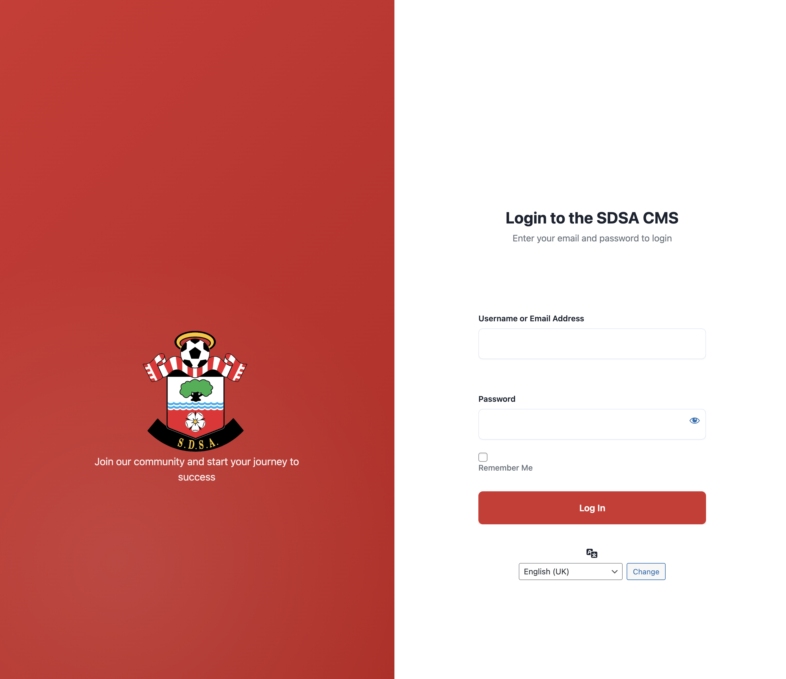

# Custom Login UI — Split Screen

Branded, split-screen WordPress login page with a left branding panel and right login form.

**Author:** Andrew Wilkinson — [MeonValleyWeb](https://meonvalleyweb.com)

---

## Screenshot

---

## Features

- Split layout: branding left, form right  
- Hides default WP branding/links  
- Custom logo with multiple fallbacks  
- CSS variables for quick theming  
- Fully responsive

---

## File(s)

- `custom-login-ui.php` (MU-plugin)  
- Optional: `assets/sdsa-login-logo.svg` (logo)

---

## Requirements

- WordPress 6.x+  
- PHP 8.x  
- Admin access to upload a logo (optional)

---

## Installation

### MU-plugin (recommended)
- Copy `custom-login-ui.php` to:  
  `wp-content/mu-plugins/custom-login-ui.php`
- (Optional) Add a logo:  
  `wp-content/mu-plugins/assets/sdsa-login-logo.svg`

### Standard plugin
- Copy `custom-login-ui.php` to:  
  `wp-content/plugins/custom-login-ui/custom-login-ui.php`  
- Activate in **Plugins**.

> MU-plugin loads automatically and is harder to disable—ideal for enforced branding.

---

## Configuration

### Logo source order
Edit `get_logo_url()` in `custom-login-ui.php`:

1. **Attachment ID** (replace `16752` with your media ID)  
2. **Theme asset**:  
   `assets/images/sdsa-login-logo.svg`  
3. **Uploads path**:  
   `uploads/2025/08/sdsa-login-logo.svg`  
4. **MU-plugin asset**:  
   `mu-plugins/assets/sdsa-login-logo.svg`  

Place your logo in one of those locations or change paths as needed.

---

### Text content
Edit in `login_header_wrapper()`: